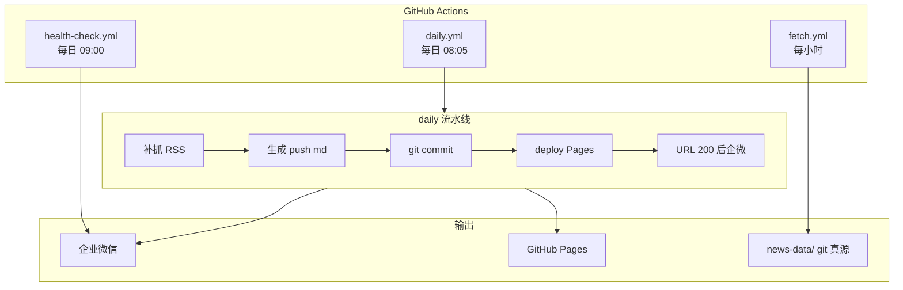

<h1 align="center">AI Daily</h1>

<p align="center"><i>筛选值得关注的 AI 信号 · 企微推送 · GitHub Pages 全文</i></p>

<p align="center">
  <a href="LICENSE"></a>
  
  
  
  
</p>

<p align="center">
  <a href="https://zk1239520941.github.io/ai-daily/">📖 阅读站点</a>
  ·
  <a href="SETUP-用户.md">📋 上线清单</a>
  ·
  基于 <a href="https://github.com/YeeKal/ai-daily">YeeKal/ai-daily</a> 二次部署
</p>

---

## 这是什么

个人/团队用的 **AI 资讯自动化流水线**：从 400+ RSS、GitHub Trending、Hacker News 抓取内容，经 LLM 评分与摘要，通过 **企业微信群机器人** 推送热点与每日 digest，并在 **GitHub Pages** 托管可读全文与长期归档。

**本仓库为独立部署实例**（[`zk1239520941/ai-daily`](https://github.com/zk1239520941/ai-daily)），生产环境 **完全由 GitHub Actions 调度**，无需自备服务器。本地 `config.json` + `loop` 模式仅用于调试。

---

## 为什么适合个人 / 小团队

| 维度 | 说明 |
|------|------|
| **零服务器** | 不需要 VPS、Docker、常开电脑或 systemd。定时任务、静态站点、数据归档全部跑在 **GitHub Actions + Pages** 上，公开仓库基本免费。 |
| **极简上手** | Fork 或 Clone 到自己账号 → 配置 **LLM API Key**（必配）与 **企微 Webhook**（接收推送）→ 开启 Pages → 即可每天自动收早报。业务参数写在 `config.user.json`，不含密钥，可随仓库提交。 |
| **日常零运维** | 没有机器要维护、没有服务要重启。Actions 按 cron 自动跑；偶发 schedule 延迟时，hourly fetch 会 **补触发** digest，健康检查仅告警不重复推。 |
| **成本可控** | 主要开销是 LLM token（按量计费），日常 hourly 抓取 + 每日 digest 通常 **每天几毛钱量级**（如 DeepSeek 等低成本模型）；Actions、Pages、企微 Webhook 对个人公开仓几乎无额外费用。 |

> 一句话：**把仓库克隆到自己账号、填两个 Secret、开 Pages**，就能在手机上收 AI 资讯推送，在网页上读全文与历史归档——无需再为服务器和运维操心。

---

## 核心能力

| 能力 | 说明 |
|------|------|
| **Hourly Fetch** | 每小时抓取 RSS、LLM 评分；≥90 分即时推企微；并检测当日 digest，必要时补触发 |
| **每日 Digest** | 北京 ~08:05 生成早报（RSS + GH + HN + 洞察）；0–N 条；四段全空则静默并留痕 |
| **Pages 全文** | digest 生成后 **同 job 部署 Pages**，URL 200 后再发企微（避免 404 链接） |
| **归档与检索** | 年 / 月列表、日历视图、客户端搜索、「往年今日」；首页最近 30 期 + 加载更多 |
| **健康检查** | 北京 ~09:00 检查当日 digest 是否执行，异常企微告警（不自动重复生成） |
| **幂等与状态** | `run-state.json` / `push-skip-*.json` 记录运行状态；已生成 digest 的 idempotent 运行不再重复推企微 |

---

## 系统架构（生产）



### Workflow 分工

| 文件 | 触发 | 作用 |
|------|------|------|
| `fetch.yml` | 每小时 | 抓取 + 评分 + 热点企微 + `ensure-digest` 补触发 + `commit-fetch` |
| `daily.yml` | 每天 08:05 UTC+8 附近 | 补抓 → digest → publish → **内联 deploy Pages** → 企微 |
| `health-check.yml` | 每天 09:00 | 检查当日 digest / skip 记录，异常告警 |
| `check.yml` | 手动 | LLM 连通性校验 |
| `pages.yml` | push 触发 / 手动 | 备用 Pages 部署（主路径已在 `daily.yml` 内完成） |

`daily.yml` 支持手动 **Run workflow**：

- `wecom_only`：Pages 已就绪时仅重发企微
- `force`：忽略当日已有 digest，强制重新生成
- `skip_fetch`：跳过补抓

---

## 快速开始

> 完整步骤（Secrets、Pages 开启、首次验证）见 **[SETUP-用户.md](./SETUP-用户.md)**。

### 1. 克隆与依赖

```powershell
git clone https://github.com/zk1239520941/ai-daily.git
cd ai-daily
uv sync
```

### 2. 本地密钥（勿提交）

```powershell
copy .env.example .env
copy config.user.json.example config.json   # 本地调试用
```

| 变量 | 说明 |
|------|------|
| `LLM_API_KEY` | LLM 评分与 digest（兼容旧名 `DEEPSEEK_API_KEY`） |
| `WECOM_WEBHOOK_URL` | 企微群机器人 Webhook |
| `PAGES_BASE_URL` | 如 `https://<user>.github.io/ai-daily/` |
| `GITHUB_TOKEN` | 可选，提高 GitHub API 限额 |
| `JINA_API_KEY` | 可选，HN 外链正文 |

### 3. GitHub Actions Secrets

仓库 **Settings → Secrets → Actions** 配置与 `.env` 同名的密钥。  
**线上真源配置**为仓库内的 [`config.user.json`](./config.user.json)（无密钥）；workflow 执行 `cp config.user.json config.json`。

字段说明、RSS/阈值/LLM 修改方式见下方 **[仓库内配置](#仓库内配置)**。

### 4. 开启 GitHub Pages

**Settings → Pages → Source：GitHub Actions**。

### 5. 本地调试命令

```bash
uv run python -m src.main check      # LLM 连通性
uv run python -m src.main fetch      # 单次抓取
uv run python -m src.main push       # 单次 digest（不推企微）
uv run python -m src.main daily      # 本地全流程
uv run python -m src.main loop       # 长跑（开发用）
```

---

## 仓库内配置

业务参数写在仓库 JSON 里，**密钥写在 Secrets / `.env`**。改配置 → 编辑对应文件 → `git commit` → `git push`，下次 Actions 运行即生效。

> 完整上线清单（建仓、Pages 开启、验收步骤）见 **[SETUP-用户.md](./SETUP-用户.md)**。本节聚焦「在仓库里改什么、怎么改」。

### 配置文件分工

| 文件 | 是否提交 | 谁在用 | 说明 |
|------|----------|--------|------|
| [`config.user.json`](./config.user.json) | ✅ 提交 | **GitHub Actions 真源** | 各 workflow 第一步执行 `cp config.user.json config.json` |
| `config.json` | ❌ `.gitignore` | 本地调试 | 从 `config.user.json.example` 或 `config.json.example` 复制；可覆盖任意字段 |
| [`config.user.json.example`](./config.user.json.example) | ✅ 提交 | 模板 | Fork 后若尚无 `config.user.json`，可复制此文件 |
| [`.env.example`](./.env.example) | ✅ 提交 | 模板 | 复制为 `.env` 填密钥；**勿提交** `.env` |
| `.github/workflows/*.yml` | ✅ 提交 | Actions 调度 | **实际触发时刻**由 workflow 内 cron 决定（UTC） |

**本地 vs 线上**：本地 `uv run python -m src.main …` 读 `config.json` + `.env`；线上读 `config.user.json`（复制为 `config.json`）+ Repository Secrets。

### Secrets 与仓库内配置的分工

| 类型 | 放哪里 | 示例 |
|------|--------|------|
| **密钥 / Webhook / Token** | `.env`（本地）或 **Settings → Secrets → Actions**（线上） | `LLM_API_KEY`、`WECOM_WEBHOOK_URL` |
| **业务参数**（无敏感信息） | **`config.user.json`**（提交到仓库） | RSS 源、评分阈值、板块开关、`llm.model` |
| **Pages 根 URL** | Secret **`PAGES_BASE_URL`** 优先；也可写 `push.wecom.pages_base_url` | `https://<user>.github.io/ai-daily/` |
| **可选 PAT** | Secret `GITHUB_TOKEN`（用户 PAT，非 Actions 内置 token） | GitHub Trending 板块 |
| **可选 Jina** | Secret `JINA_API_KEY` | Hacker News 外链正文抓取 |

`config.user.json` 里用 `apiKeyName` / `tokenName` / `jinaTokenName` **指向**环境变量名，**不存放** Key 本身。

#### GitHub Secrets 清单

在 **Settings → Secrets and variables → Actions** 配置：

| Secret | 必填 | 对应 config 字段 | 说明 |
|--------|------|------------------|------|
| `LLM_API_KEY` | ✅ | `llm.apiKeyName`（默认 `LLM_API_KEY`） | OpenAI 兼容接口的 API Key |
| `WECOM_WEBHOOK_URL` | ✅（企微推送时） | `push.wecom.apiKeyName` | 企微群机器人 Webhook |
| `PAGES_BASE_URL` | 推荐 | `push.wecom.pages_base_url` 的 env 覆盖 | digest 企微「完整版」链接根 URL |
| `GITHUB_TOKEN` | 可选 | `sections.github_trending.tokenName` | 用户 PAT，提高 Trending API 限额 |
| `JINA_API_KEY` | 可选 | `sections.hackernews.jinaTokenName` | HN 外链正文（Jina Reader） |
| `FEISHU_WEBHOOK_URL` | 可选 | `push.feishu.apiKeyName` | 飞书（需 `push.feishu.enabled: true`） |
| `DISCORD_WEBHOOK_URL` | 可选 | `push.discord.apiKeyName` | Discord（需 `push.discord.enabled: true`） |

> 向后兼容：环境变量仍可使用旧名 `DEEPSEEK_API_KEY`，程序会读取（`LLM_API_KEY` 优先）。

### `config.user.json` 主要字段

#### `sources` — RSS 源

| 字段 | 说明 |
|------|------|
| `base_opml` | 基础 OPML 路径，默认 `resources/rss.opml`（400+ 源） |
| `add` | 追加源数组，每项 `{ "title", "xmlUrl", "category" }` |
| `block` | 按 `xmlUrl` 精确屏蔽 |
| `block_domains` | 域名屏蔽，支持 `*.substack.com` 通配 |

**改 RSS 源**：编辑 `config.user.json` 的 `sources` 块 → 提交 push。例如追加一条：

```json
{
  "title": "Your Feed",
  "xmlUrl": "https://example.com/feed.xml",
  "category": "AI"
}
```

要屏蔽某 OPML 内已有源，在 `block` 里写相同 `xmlUrl`；要屏蔽整类域名，加到 `block_domains`。

#### `filter` — 评分与 digest 行为

| 字段 | 默认 | 说明 |
|------|------|------|
| `min_score` | `60` | 进入 digest 候选的最低 LLM 分 |
| `hot_threshold` | `90` | ≥ 此分 **即时推企微**（hourly fetch） |
| `context_days` | `3` | 评分上下文回溯天数 |
| `push_window_hours` | `24` | digest 收录时间窗口（小时） |
| `skip_empty_digest` | `true` | 四段全空时不生成 digest |
| `exclude_notified_links_from_digest` | `true` | 已即时推送的链接不再进 digest |

**改评分阈值**：调 `min_score`（digest 门槛）或 `hot_threshold`（热点即时推）。例如只想 digest、不要 hourly 热点，可将 `hot_threshold` 设为 `100`。

#### `schedule` — 时区与 cron 语义

| 字段 | 默认 | 说明 |
|------|------|------|
| `timezone_hours` | `8` | 展示与 push 边界用的 UTC 偏移（北京 = 8） |
| `push_cron` | `["0 8 * * *"]` | **digest 收录窗口**的本地 cron 语义（非 GHA 触发器） |
| `fetch_interval_minutes` | `60` | 与 hourly fetch 对齐的参考值 |
| `fetch_lookback_minutes` | `120` | 单次抓取回溯窗口 |

**改推送时间**需两处配合：

1. **实际触发**：改 [`.github/workflows/daily.yml`](./.github/workflows/daily.yml) 的 `schedule.cron`（**UTC**）。当前 `5 0 * * *` ≈ 北京 08:05。
2. **收录边界语义**：改 `schedule.push_cron` 与 `timezone_hours`，使 digest 知道「本地几点算早报截止」。

`fetch.yml` / `health-check.yml` 的 cron 同样在 workflow 文件里（分别为每小时、`0 1 * * *` UTC ≈ 北京 09:00）。

#### `sections` — 早报板块

| 块 | 关键字段 | 说明 |
|----|----------|------|
| `github_trending` | `enabled`, `max_items`, `tokenName` | GitHub Trending；需 Secret `GITHUB_TOKEN`（可选） |
| `hackernews` | `enabled`, `select_k`, `jinaTokenName` | HN 精选；Jina 需 `JINA_API_KEY` |
| `insights` | `enabled` | LLM 洞察段 |

关闭某板块：对应块设 `"enabled": false`。

#### `llm` — 大模型

| 字段 | 说明 |
|------|------|
| `provider` | 固定 `"openai"`（OpenAI 兼容协议） |
| `baseUrl` | API 根 URL，如 `https://api.openai.com/v1` |
| `model` | 模型名，如 `gpt-4o-mini` |
| `apiKeyName` | 读哪个环境变量，默认 `LLM_API_KEY` |
| `max_prompt_chars` | 单次 prompt 字符上限 |
| `prompts` | 各阶段 prompt 文件路径（一般无需改） |

**换模型**（三步）：

1. 在 `config.user.json` 改 `llm.baseUrl` + `llm.model`
2. 在 Secrets（或本地 `.env`）配置对应提供商的 **`LLM_API_KEY`**
3. push 后 **Actions → AI Daily LLM 校验 → Run workflow** 或本地 `uv run python -m src.main check`

示例（OpenAI）：

```json
"llm": {
  "provider": "openai",
  "baseUrl": "https://api.openai.com/v1",
  "model": "gpt-4o-mini",
  "apiKeyName": "LLM_API_KEY"
}
```

#### `push.wecom` — 企微与 Pages 链接

| 字段 | 说明 |
|------|------|
| `enabled` | `true` 启用企微推送 |
| `apiKeyName` | Webhook 环境变量名，默认 `WECOM_WEBHOOK_URL` |
| `mode` | 推送格式，默认 `news`（图文卡片） |
| `pages_base_url` | Pages 根 URL；**留空时**优先读 env `PAGES_BASE_URL`，再尝试从 `GITHUB_REPOSITORY` 推断 |

**企微 digest 完整版链接**解析顺序：`PAGES_BASE_URL`（Secret）→ `push.wecom.pages_base_url` → `https://<owner>.github.io/<repo>/`。

推荐：Secret 设 `PAGES_BASE_URL=https://<你的用户名>.github.io/ai-daily/`（末尾 `/` 可有可无，程序会规范化）。

#### `fetch` / `log`

| 块 | 说明 |
|----|------|
| `fetch.max_workers` / `timeout` | 并发抓取数与超时 |
| `log.retention_days` | 本地日志保留天数 |

### 首次 Fork / Clone 最小配置

- [ ] Fork 或 clone 到自有 GitHub 账号
- [ ] 确认仓库根目录有 [`config.user.json`](./config.user.json)（或从 `config.user.json.example` 复制）
- [ ] 按需编辑 `config.user.json`（RSS、阈值、板块、`llm.baseUrl` / `llm.model`）
- [ ] **Settings → Secrets → Actions** 添加 `LLM_API_KEY`、`WECOM_WEBHOOK_URL`、`PAGES_BASE_URL`
- [ ] **Settings → Pages → Source：GitHub Actions**
- [ ] `git push` 后 **Actions → AI Daily 早报 → Run workflow** 做首次全链路验证
- [ ] 本地调试时：`copy .env.example .env`、`copy config.user.json.example config.json`，填 `.env` 后 `uv run python -m src.main check`

更细的建仓、验收与排错步骤见 **[SETUP-用户.md](./SETUP-用户.md)**。

---

## 数据与站点

| 路径 | 说明 |
|------|------|
| `news-data/fetch-*.json` | 按日抓取与评分结果 |
| `news-data/notify-*.md` | 即时热点推送归档 |
| `news-data/push-*.md` / `.html` | 日报正文（**永久保留**，驱动 Pages） |
| `news-data/issues-index.json` | 期数索引（首页加载更多、归档入口） |
| `news-data/run-state.json` | 最近 fetch / digest 状态 |
| `index.html` | Pages 首页（最近 30 期 SSR + 加载更多） |
| `archive/` | 按年 / 月列表与日历视图 |
| `search.html` | 客户端全文搜索（Fuse.js） |

线上阅读：[站点首页](https://zk1239520941.github.io/ai-daily/) · [归档](https://zk1239520941.github.io/ai-daily/archive/) · [搜索](https://zk1239520941.github.io/ai-daily/search.html)

---

## 费用与配额

| 项目 | 公开仓库（当前） | 说明 |
|------|------------------|------|
| GitHub Actions | **基本免费** | 定时抓取与 deploy，无需自购算力 |
| GitHub Pages | **免费** | 静态站点托管全文与归档 |
| LLM API | 按 token 计费 | **主要可变成本**；日常约几毛 / 天（DeepSeek 等为低成本选项之一） |
| 企微 Webhook | 免费 | 推送到群，无需自建消息服务 |

**没有** 服务器月租、域名（可用 `*.github.io`）、数据库、运维人力等隐性成本。若改为 **Private** 仓库，Actions 有每月 2000 分钟限额，hourly fetch 可能较快触顶，需减频或升级计划。

---

## 上游与致谢

- 项目骨架与核心逻辑 fork 自 **[YeeKal/ai-daily](https://github.com/YeeKal/ai-daily)**（MIT）
- RSS 源 OPML 整理参考 **[BestBlogs](https://github.com/ginobefun/BestBlogs)**
- 本仓库在此基础上改为：**GitHub Actions 全自动 + 企微 + Pages 内联部署 + 运行状态机**

---

## 可选：Linux systemd 部署

上游提供的 `./scripts/install.sh` 仍可用于自有 Linux 服务器部署（不依赖 Actions）。本实例 **生产默认不用此路径**；相关说明见 upstream README 历史版本或 `scripts/` 目录。

---

## License

MIT License — 见 [LICENSE](./LICENSE)。
