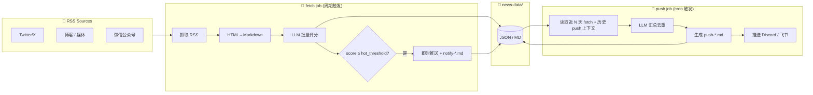

# tech-spec.md - 技术架构总览

> 本文档面向未来的 AI Agent 与核心开发者，目的是在阅读源码之前快速建立对项目的整体认识：项目定位、运行模式、核心数据流、模块边界、部署形态、关键约束。
>
> **本文写什么**：架构层面的"是什么、为什么、边界在哪里"；跨模块的数据流和契约；部署/运行环境约束；不读源码就无法获知的设计决策。
>
> **本文不写什么**：源码摘录、函数签名、字段清单、命令行帮助、变更日志、UI/文案。这些信息以源码、`README.md`、`docs/plan.md`、`config.json` 为准。
>
> **维护原则**：当架构边界、数据流、运行环境、部署形态或核心设计决策发生变化时同步更新本文；普通实现调整、字段增删、文案修改不在维护范围内。
>
> update: 2026-05-17

> **本 fork 生产部署**：GitHub Actions（`fetch.yml` / `daily.yml` / `health-check.yml`），`config.user.json` + Secrets，企微 + Pages 内联部署。下文 systemd 章节为 **upstream 服务器路径**。

## 项目定位

AI 驱动的 RSS 新闻聚合与推送系统：周期性抓取 400+ AI 领域信息源，调用 LLM 评分筛选，按调度规则将高分内容汇总推送（本实例：**企业微信** + GitHub Pages 全文）；高分热点条目在 fetch 阶段即时推送。

面向单机部署、单租户使用，所有状态以本地文件（JSON / Markdown）持久化，不依赖外部数据库或队列。

## 运行模式

| 模式 | 触发方 | 适用场景 |
|------|--------|----------|
| **生产**（推荐） | systemd timer 分别触发 `fetch` 与 `push` 单次任务 | 服务器长期运行，依赖 systemd 提供调度、重启、开机自启 |
| **开发** | `loop` 子命令在单进程内并发跑 fetch/push 双循环 | 本地调试，无需 systemd |

CLI 子命令分工（详见 `python -m src.main --help`）：

- `check`：**唯一**的 LLM 健康检查入口，仅在部署期由 `install.sh` 调用
- `fetch` / `push`：单次执行后退出，由 systemd timer 触发；运行期不再做 LLM 健康检查，异常由统一的告警通道兜底
- `loop`：开发模式，启动时做一次健康检查，然后并发跑 fetch/push 循环
- `github` / `hackernews`：单板块手动调试入口；只跑对应板块（含 LLM 总结），打印 markdown 到终端，**不**推送、**不**写入 push 文件。仅供 prompt 调优期使用

关键约束：`fetch` / `push` 失败时进程退出码非 0，systemd 据此判定 service 失败，下个 timer 周期自动重试。

## 核心架构

### 调度模型（生产）

```
┌─────────────────────────────────────────────────────────────┐
│                     config.json                             │
│  schedule.fetch_interval_minutes  → dnews-fetch.timer       │
│  schedule.push_cron               → dnews-push.timer        │
│  log.retention_days               → journald@dnews retention│
└────────────────────────┬────────────────────────────────────┘
                         │ scripts/install.sh 渲染并安装
            ┌────────────┴────────────┐
            ▼                         ▼
  ┌───────────────────┐     ┌───────────────────┐
  │ dnews-fetch.timer │     │ dnews-push.timer  │
  └─────────┬─────────┘     └─────────┬─────────┘
            ▼                         ▼
  ┌───────────────────┐     ┌───────────────────┐
  │ fetch.service     │     │ push.service      │
  │  抓取+评分+热点推送│     │ 收集+汇总+推送     │
  └─────────┬─────────┘     └─────────┬─────────┘
            └────────────┬────────────┘
                         ▼
                ┌─────────────────┐
                │   news-data/    │
                │   fetch-*.json  │
                │   push-*.md     │
                │   notify-*.md   │
                └─────────────────┘
```

开发模式（`loop`）以 `asyncio.gather(fetch_loop, push_loop)` 并发运行两条循环，`push_loop` 通过 croniter 计算下次触发时间，行为等价于生产模式但共享单进程。

### 数据流



**关键数据契约**：

- `fetch-YYYY-MM-DD.json`：当日抓取与评分结果（含 score / summary / tags / content）
- `push-YYYY-MM-DD.md`：汇总推送内容（YAML frontmatter + Markdown 正文），同时作为下一次 push 的去重上下文
- `notify-YYYY-MM-DD.md`：即时推送记录，作为 LLM 即时推送时的去重上下文

具体字段以源码 `src/storage.py` 与样例文件为准，README "数据示例" 章节给出了一份示例。

## 关键模块边界

```
src/                       运行时代码
├── main.py                CLI 入口；定义 fetch_job / push_job / loop 的编排顺序
├── config.py              加载 config.json，合并 OPML + add/block，做配置校验
├── fetcher.py             RSS 抓取；并发控制、UA 伪装、域名通配符屏蔽；nitter/xcancel 走独立的 requests+Inoreader UA 低并发池
├── processor.py           HTML → Markdown 转换
├── llm.py                 LLM 客户端;批量评分、即时推送生成、汇总生成、错误聚合
├── storage.py             news-data 文件读写;按日期分片;过期清理
└── push/                  推送平台抽象
    ├── base.py            PushPlatform 基类(validate_config / send)
    ├── discord.py
    └── feishu.py

scripts/                   部署脚本(仅生产 systemd 部署使用)
├── install.sh             一键安装:uv sync → LLM check → 渲染单元 → 装入系统 → 启用
├── uninstall.sh           卸载 systemd 单元、daily-news 包装脚本和日志 drop-in;不删数据
├── status.sh              查看 timer/service 状态(daily-news status 包装它)
├── _gen_units.py          从 config.json 渲染 systemd 单元和 daily-news 包装脚本
└── daily-news.tmpl        /usr/local/bin/daily-news 的脚本模板,封装 systemctl/journalctl

systemd/                   systemd 单元模板(由 _gen_units.py 渲染并装入 /etc/systemd/system/)
├── dnews-fetch.service.tmpl    fetch service 单元模板
├── dnews-fetch.timer.tmpl      fetch 定时器(OnUnitActiveSec 间隔触发)
├── dnews-push.service.tmpl     push service 单元模板
├── dnews-push.timer.tmpl       push 定时器(OnCalendar 日历触发)
└── journald-dnews.conf.tmpl    journald 命名空间 dnews 的日志保留 drop-in

config.json                主配置;运行参数 + 调度 + LLM + 推送渠道;唯一可热改的运行配置
prompts/                   LLM 提示词文本;score / immediate_push / digest 各自独立文件
resources/rss.opml         基础 RSS 订阅源(约 420 个),通过 sources.add/block 增量调整
.env                       敏感凭证(API Key / Webhook URL),通过环境变量注入,不入库
```

### 板块化扩展 (morning push)

早报推送在 RSS 之上扩展三个板块:GitHub 趋势 / Hacker News 热议 / 跨板块洞察。模块结构、数据流与失败降级详见 `docs/extra-sections-design.md`。架构层关键约束:

- 仅在当天 `schedule.push_cron` 列表里最早那次触发时启用(单条 cron 时每次都启用),其余时段维持纯 RSS 行为
- 各板块封装为 `src/sections/<board>/section.py::run_xxx_section(config, now) -> (markdown, error)`
- `push_job` 用 `asyncio.gather` 并发跑 RSS / GH / HN,串行接 insights;最后用 `<!-- SECTION:xxx BEGIN/END -->` sentinel 包入 push 文件
- 仅 RSS 失败会让 push_job 整体退出非 0;其余板块失败 → 板块整段省略 + 告警

新增持久化文件:`news-data/trending-history.json`(GH 已查阅 repo 索引,按 `filter.keep_days` 过期)

模块协作的关键约定：

- **fetch 与 push 之间通过文件系统解耦**：双方不直接通信，push 只读 fetch 已写入的 JSON
- **LLM 调用的错误处理由调用方决定**：`llm.py` 不做 fallback，失败时返回 `(空内容, 错误列表)`；调用方决定是否告警或跳过推送，避免一个批次失败污染整次任务
- **批量评分按 `link` 字段对齐**：LLM 返回的条目数可能少于输入，按 link 匹配并丢弃无法对齐的结果，错误聚合后由调用方统一上报
- **推送平台通过基类多态**：新增平台只需实现 `validate_config()` 与 `send()`，并在工厂函数注册，main.py 无需改动

## 数据边界与持久化

- 所有持久化数据落在项目根目录的 `news-data/`：按日期分片的 `fetch-*.json` / `push-*.md` / `notify-*.md`
- 过期文件由 fetch job 在每次执行后清理，保留窗口由 `filter.keep_days` 控制
- 没有数据库、没有外部缓存、没有跨机器同步；状态完全可由文件系统重建
- 敏感信息（API Key、Webhook URL）只通过环境变量注入，禁止写入 `config.json` 或代码

## 配置与约束

完整配置字段说明见 `README.md` 的"配置详解"章节，本文只列出对架构有影响的约束。

### schedule

| 字段 | 约束 |
|------|------|
| `fetch_interval_minutes` | systemd 部署下用 `OnUnitActiveSec` 实现，从上次任务**完成**开始计时（非日历对齐） |
| `fetch_lookback_minutes` | 必须大于 `fetch_interval_minutes`，用作 RSS 延迟的冗余窗口，依赖 link 去重防止重复入库 |
| `push_cron` | systemd 部署下**只支持 minute/hour 字段**，其他位必须为 `*`；不支持范围、列表、`*/N`。`loop` 模式下走 croniter，支持完整语法 |
| `timezone_hours` | 整数小时偏移；用于显示和 cron 计算 |

### log

`log.retention_days` 仅对 systemd 部署生效，由 `install.sh` 渲染到 journald 命名空间 `dnews` 的 drop-in 配置；修改后必须重跑 `install.sh`。

### LLM

`llm.max_prompt_chars` 决定批次切分粒度，`llm.max_concurrent_batches` 决定批次并发数。这两个值同时影响吞吐和单次推送的成本上限。

### 环境变量

敏感凭证名通过 config.json 的 `*.apiKeyName` 字段指定环境变量名，由 `os.environ` 读取；约定通过 `.env` 提供，systemd 部署时 install.sh 会注入到 service 单元的 `EnvironmentFile`。

## systemd 部署形态

### 文件落点

| 文件 | 位置 | 来源 |
|------|------|------|
| `dnews-{fetch,push}.{service,timer}` | `/etc/systemd/system/` | `systemd/*.tmpl` 由 `_gen_units.py` 渲染 |
| `journald@dnews` retention drop-in | `/etc/systemd/journald@dnews.conf.d/` | `systemd/journald-dnews.conf.tmpl` |
| `daily-news` 包装脚本 | `/usr/local/bin/` | `scripts/daily-news.tmpl` |
| 持久化数据 | 项目目录下的 `news-data/` | 运行时生成 |

### cron → OnCalendar 转换

由 `scripts/_gen_units.py` 完成：

- `fetch_interval_minutes` → `OnActiveSec` + `OnUnitActiveSec`（间隔触发，跟随上次完成时间）
- `push_cron` → `OnCalendar`（日历触发，按指定时刻）
- 不支持的 cron 语法（范围、列表、`*/N` 在 minute/hour、非 `*` 的 day/month/dow）在 install 阶段直接报错

### 日志

- 所有 stdout/stderr 进入 journald 命名空间 `dnews`，与系统其他服务隔离
- 查询：`journalctl --namespace=dnews -u dnews-fetch -f`
- 卸载不会清理历史日志，需要时手动 `journalctl --namespace=dnews --vacuum-time=1s`

## 设计决策（重要的"为什么"）

| 决策 | 原因 |
|------|------|
| 调度交给 systemd timer 而非 asyncio 循环 | 进程崩溃和服务器重启可自愈；调度配置即声明式单元，热更新只需重跑 install.sh |
| LLM 健康检查只在 `check` 子命令做 | 每次 timer 触发都校验会产生无意义的 LLM API 调用；运行期错误由 `notify_llm_errors` 兜底 |
| LLM 失败时不生成 fallback 内容 | 避免低质量内容污染推送；由调用方决定告警或跳过 |
| 用 journald 命名空间而非文件日志 | 自动轮转、与系统日志隔离、无需写文件 IO 代码 |
| 数据全用本地文件而非数据库 | 单机单租户场景下足够；可读、可备份、可手动审阅 |
| `fetch_lookback_minutes` 冗余窗口 | RSS 源时间戳常有延迟，仅按时间过滤会漏读；冗余抓取后按 link 去重 |
| Push 上下文带入近 N 天历史 push 文件 | 避免汇总推送在多个时段重复推同一条目 |

## 扩展指南

- **新推送平台**：在 `src/push/` 新建文件，继承 `PushPlatform`，在工厂注册
- **新评分维度**：编辑 `prompts/score.txt`，调整评分标准
- **新 RSS 源**：编辑 `config.json` 的 `sources.add` / `sources.block` / `sources.block_domains`，无需修改 OPML

## 测试

测试入口分两类，详细命令参考 `README.md` 与 `tests/` 目录：

- `tests/pytest/`：单元/集成测试，CI 友好，`uv run pytest tests/pytest/` 一键跑
- `tests/*.py`：交互式实操脚本（`fetch_news.py` / `push_news.py` / `run_llm_test.py` 等），针对真实 RSS 与 LLM 做端到端验证，用于调参和手测

## 相关文档

- 用户文档与配置详解：`README.md`
- 任务进度与产品决策：`docs/plan.md`
